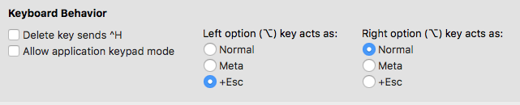

# ~/.dotfiles

My personal dot files.

## Dependencies

- [oh-my-zsh](https://github.com/robbyrussell/oh-my-zsh)
- [rbenv](https://github.com/rbenv/rbenv)
- [ruby-build](https://github.com/rbenv/ruby-build#installing-as-an-rbenv-plugin-recommended)
- [nvim](https://neovim.io/)
- [[Vim]lociraptor](https://github.com/Lucasosf/vimlociraptor)
- [tmux](https://tmux.github.io/)
- [tmuxinator](https://github.com/tmuxinator/tmuxinator)


## Tips
- [tmux cheat sheet](https://gist.github.com/andreyvit/2921703)

## Mac

Map left option key as `+Esc`, Preferences > Profiles > Keys:

# 


Install `reattach-to-user-namespace` in order to use copy and paste again:

```bash
brew install reattach-to-user-namespace
```
