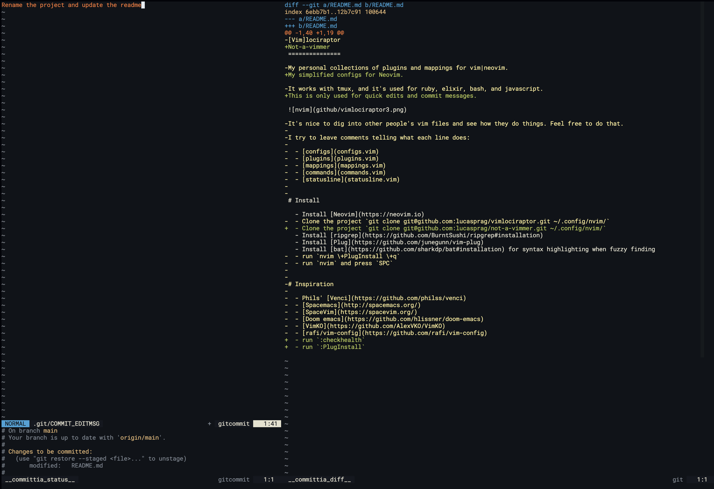

Not-a-vimmer
===============

My simplified configs for Neovim.

This is only used for quick edits and commit messages.

# Install

- Install [ripgrep](https://github.com/BurntSushi/ripgrep#installation)
- Install [Plug](https://github.com/junegunn/vim-plug)
- Install [bat](https://github.com/sharkdp/bat#installation) for syntax highlighting when fuzzy finding
- run `:checkhealth`
- run `:PlugInstall`
